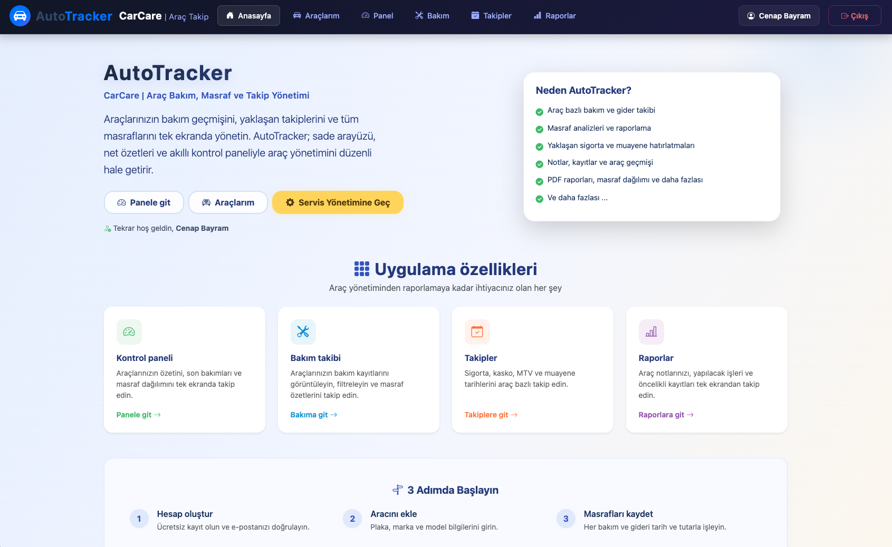
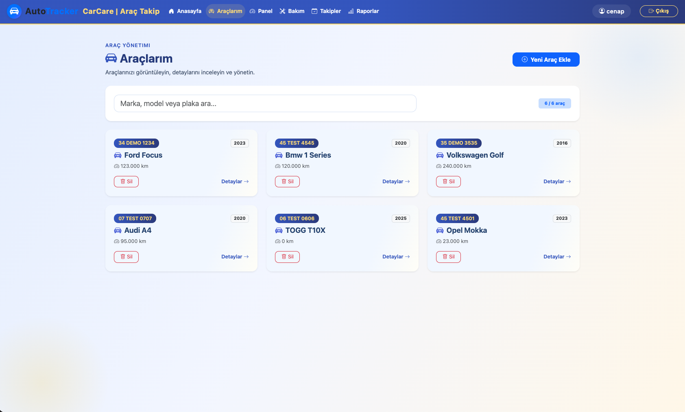
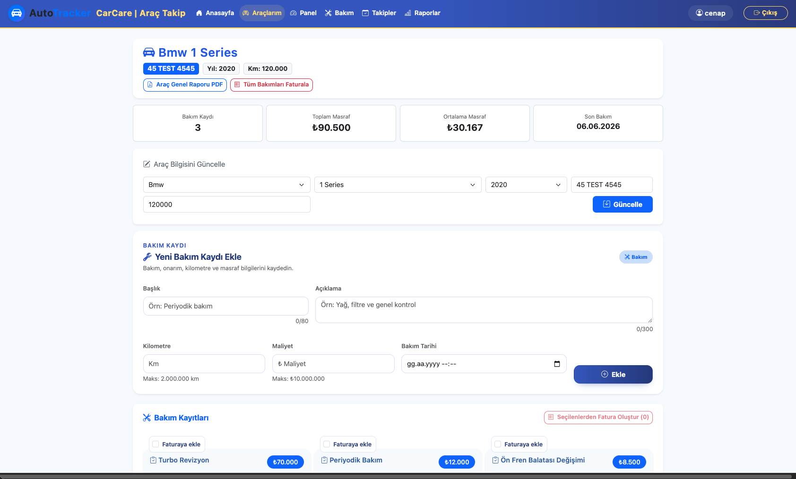
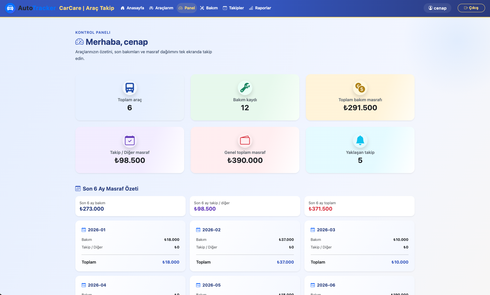
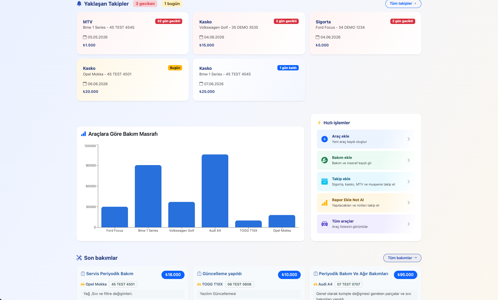
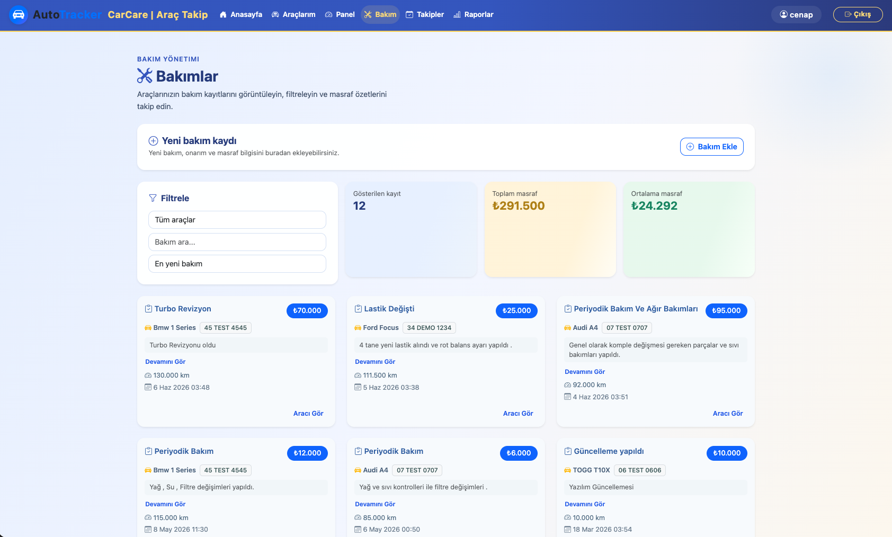
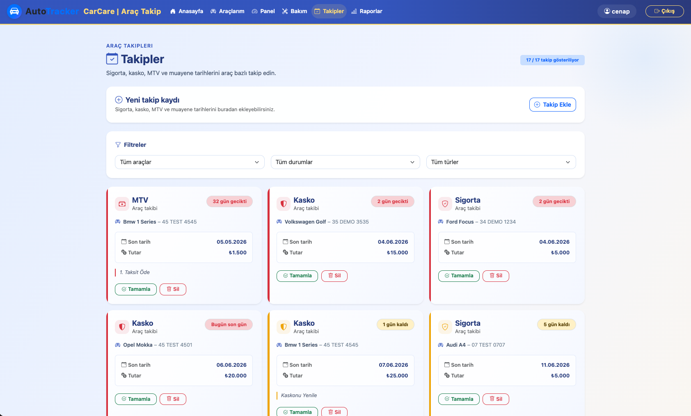
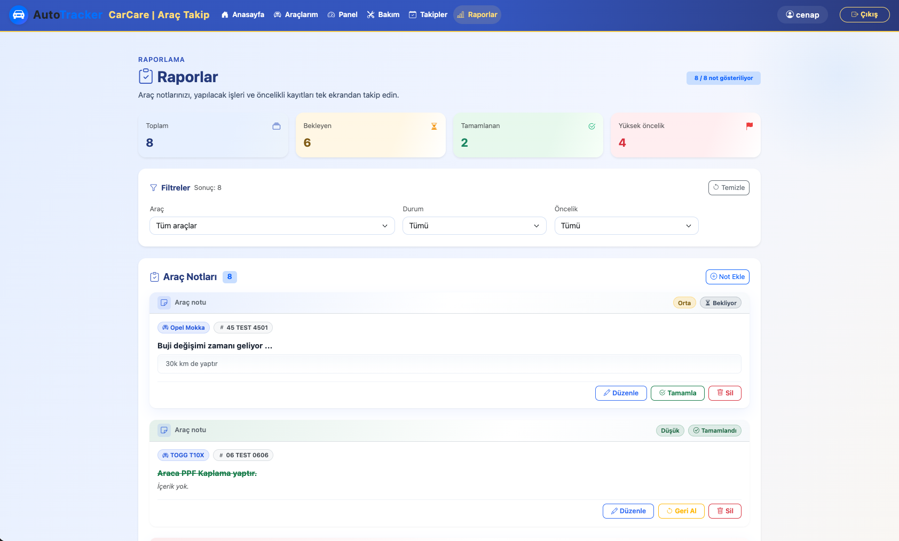
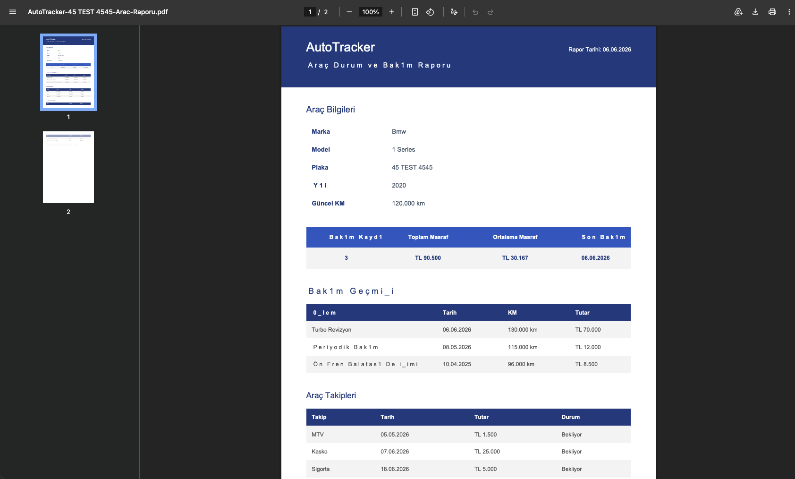
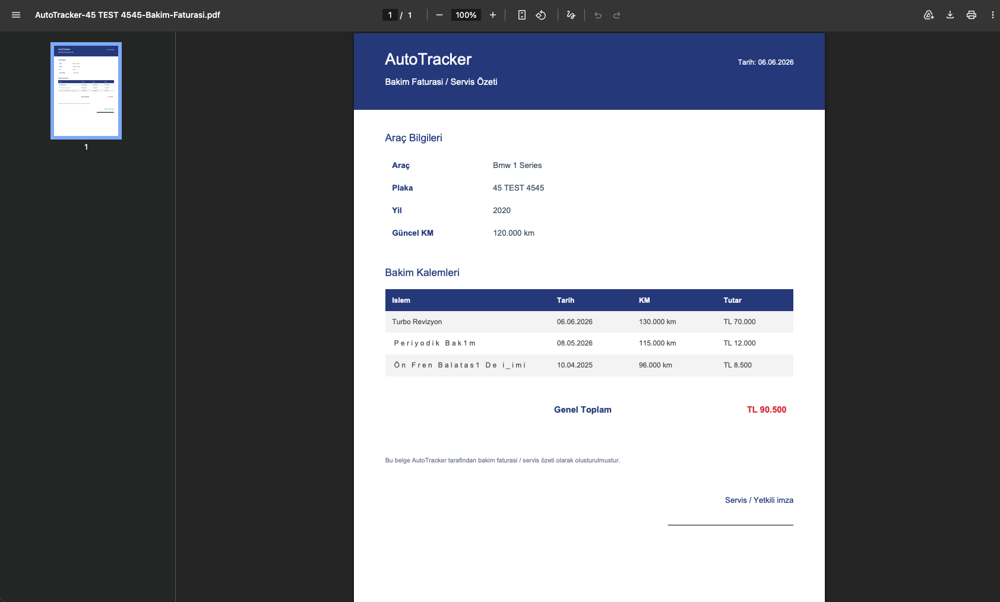

# 🚗 AutoTracker

AutoTracker is a full-stack vehicle management platform that helps individuals and businesses track maintenance history, mileage, expenses, reminders, reports, and vehicle-related records from a centralized dashboard.

Built with React, ASP.NET Core Web API, PostgreSQL, and Docker, the project focuses on secure authentication, scalable architecture, and real-world software engineering practices.

Designed for vehicle owners, service centers, repair shops, fleet operators, and rental companies, AutoTracker simplifies vehicle lifecycle management by organizing maintenance records, costs, notes, reminders, and reporting in a single platform.

## ✨ Key Highlights

| Category                     | Technologies & Features                                                                                                    |
| ---------------------------- | -------------------------------------------------------------------------------------------------------------------------- |
| 🔐 Security & Authentication | JWT Authentication & Authorization, Password Hashing, Email Verification, Password Recovery, User-Based Data Isolation , Global Exception Handling    |
| 🚗 Vehicle Management        | Vehicle Registration, Vehicle Tracking, Mileage Monitoring, Vehicle Lifecycle Management                                   |
| 🔧 Maintenance & Operations  | Maintenance Records, Service History, Cost Tracking, Maintenance Scheduling, Vehicle Reminders                             |
| 📝 Documentation & Reporting | Vehicle Notes, Operational Records, PDF Reporting, Long-Term Record Keeping                                                |
| ⚛️ Full-Stack Engineering    | React, React Router, Axios, Bootstrap, ASP.NET Core Web API, RESTful API Architecture, SPA Routing, Swagger/OpenAPI Documentation                         |
| 🗄️ Data Management          | PostgreSQL, Relational Database Design, Entity Framework Core ORM, Automated Database Migrations ,Health Checks                          |
| 🐳 DevOps & Deployment       | Dockerized Frontend, Backend & Database, Docker Compose, Nginx, Persistent Volumes, Containerized Deployment               |
| 🏗️ Architecture             | Modular Project Structure, Environment-Based Configuration, Scalable Full-Stack Architecture, Production-Ready Environment |


## Why AutoTracker?

Vehicle-related information is often scattered across spreadsheets, notes, paper records, and different applications. AutoTracker was created to centralize maintenance history, mileage records, expenses, reminders, and vehicle data into a single, organized platform.

In addition to solving a real-world problem, the project serves as a portfolio-grade full-stack application showcasing modern software engineering practices such as secure authentication, RESTful APIs, relational database design, and Docker-based deployment.

## 🚀 Core Features

| Feature Area                         | Description                                                                                                                                    |
| ------------------------------------ | ---------------------------------------------------------------------------------------------------------------------------------------------- |
| 🔐 Authentication & Security         | User registration, login, JWT authentication, password hashing, email verification, password recovery, and account protection mechanisms.      |
| 🚘 Vehicle Management                | Create, update, and manage vehicle records with detailed vehicle information, mileage tracking, and ownership history.                         |
| 🔧 Maintenance & Service Management  | Track maintenance operations, repair history, service details, maintenance costs, and mileage-based service records.                           |
| 💰 Expense Tracking                  | Monitor vehicle-related expenses and maintenance costs to maintain a clear financial overview of vehicle ownership and operations.             |
| 📝 Notes & Documentation             | Store vehicle-specific notes, observations, operational records, and important vehicle information.                                            |
| ⏰ Reminder Management                | Create and manage reminders for maintenance schedules, inspections, service intervals, and other vehicle-related tasks.                        |
| 📄 Reporting & PDF Export            | Generate downloadable PDF reports containing vehicle information, maintenance history, mileage records, expenses, notes, and operational data. |
| 👥 User-Based Data Isolation         | Ensure secure access control by allowing users to access and manage only their own data.                                                       |
| 🏗️ Scalable Full-Stack Architecture | Built with React, ASP.NET Core Web API, PostgreSQL, Docker, and Nginx using a scalable and maintainable architecture.                          |


## 🏗️ System Architecture

| Layer             | Technology                         |
| ----------------- | ---------------------------------- |
| 🎨 Frontend       | React, Vite, Nginx                 |
| ⚙️ Backend        | ASP.NET Core Web API               |
| 🔐 Authentication | JWT Authentication & Authorization |
| 🗄️ Database      | PostgreSQL                         |
| 🔄 ORM            | Entity Framework Core              |
| 🐳 Infrastructure | Docker & Docker Compose            |
| 💾 Persistence    | Docker Volumes                     |

### Architecture Overview

AutoTracker follows a modern full-stack architecture where a React frontend communicates with an ASP.NET Core Web API through RESTful endpoints. Authentication is handled using JWT, data access is managed with Entity Framework Core, and PostgreSQL provides persistent relational storage.

The entire application stack is containerized with Docker and orchestrated through Docker Compose, creating a scalable, maintainable, and deployment-ready environment.


## 🛠️ Technology Stack

AutoTracker is built using a modern full-stack technology ecosystem designed for scalability, maintainability, security, and real-world deployment scenarios.

### 🎨 Frontend Technologies

- React — Component-based user interface development
- Vite — Fast development environment and optimized production builds
- React Router — Client-side routing and navigation
- Axios — HTTP communication with backend services
- Bootstrap — Responsive and modern user interface design
- JavaScript (ES6+) — Modern frontend development

### ⚙️ Backend Technologies

- ASP.NET Core Web API (.NET 10) — High-performance backend framework
- Entity Framework Core — Object-relational mapping (ORM)
- JWT Authentication — Secure authentication and authorization
- RESTful API Design — Scalable service-oriented architecture
- DTO-Based Data Transfer — Clean and maintainable API contracts
- Swagger / OpenAPI Documentation
- Global Exception Handling Middleware
- Health Check Monitoring

### 🗄️ Database Layer

- PostgreSQL — Enterprise-grade relational database system
- Relational Database Design — Structured and scalable data modeling
- Database Migrations — Version-controlled schema management

### 🐳 Infrastructure & Deployment

- Docker — Containerized application deployment
- Docker Compose — Multi-container service orchestration
- Nginx — Frontend hosting and SPA routing support
- Docker Volumes — Persistent database storage

### 🔒 Security & Communication

- JWT Bearer Authentication
- Password Hashing
- Email Verification Workflow
- Password Recovery & Reset System
- Gmail SMTP Integration
- Custom HTML Email Templates

### 🧰 Development & Productivity Tools

- Git & GitHub — Version control and collaboration
- Postman — API testing and validation
- pgAdmin — PostgreSQL administration
- VS Code / Cursor — Development environment

### 🏛️ Architectural Principles

- Separation of Concerns (SoC)
- Layered Architecture
- RESTful Service Design
- User-Based Data Isolation
- Containerized Development Environment
- Scalable and Maintainable Project Struct


## 📸 Screenshots

<p align="center">
  
  
</p>

<p align="center">
  
  
</p>

<p align="center">
  
  
</p>

<p align="center">
  
  
</p>

<p align="center">
  
  
</p>


## 🐳 Docker & Deployment

AutoTracker is fully containerized using Docker, providing a consistent development and deployment environment across different machines and operating systems.

The application is orchestrated with Docker Compose and consists of multiple independent services working together as a complete full-stack platform.

### Included Services

- React Frontend — User interface served through Nginx
- ASP.NET Core Web API — Backend business logic and REST API services
- PostgreSQL Database — Persistent relational data storage
- Docker Volumes — Database persistence across container restarts
- Docker Network — Internal communication between services

### Deployment Flow

| Stage        | Component            |
| ------------ | -------------------- |
| 🎨 Frontend  | React + Nginx        |
| ⚙️ API Layer | ASP.NET Core Web API |
| 🗄️ Database | PostgreSQL           |
| 💾 Storage   | Docker Volumes       |


### Key Benefits

- Consistent development environment
- Simplified project setup
- Isolated application services
- Persistent database storage
- Production-ready containerized architecture
- Easy deployment and scalability

### Containerized Services

- autotracker-frontend
- autotracker-api
- autotracker-postgres

### Start the Application

```bash

docker compose up --build

```

Once started, all required services are automatically created, configured, and connected through Docker Compose.

## 📂 Project Structure

```text
AutoTracker
│
├── frontend
│   ├── src
│   │   ├── api
│   │   ├── assets
│   │   ├── components
│   │   ├── constants
│   │   ├── pages
│   │   ├── services
│   │   ├── styles
│   │   ├── App.jsx
│   │   └── main.jsx
│   │
│   ├── public
│   ├── Dockerfile
│   ├── nginx.conf
│   └── package.json
│
├── backend
│   └── AutoTracker.Api
│       ├── Controllers
│       ├── DTOs
│       ├── Data
│       ├── Models
│       ├── Services
│       ├── Migrations
│       ├── Properties
│       ├── Program.cs
│       ├── Dockerfile
│       └── AutoTracker.Api.csproj
│
├── docker-compose.yml
├── README.md
└── .gitignore
```


### Structure Overview

- frontend/ — React-based user interface and client-side application logic.
- backend/ — ASP.NET Core Web API containing business logic, authentication, data access, and API endpoints.
- Migrations/ — Entity Framework Core database migration history and schema management.
- docker-compose.yml — Multi-container application orchestration and service configuration.
- README.md — Project documentation and setup instructions.


## 🚀 Getting Started

### Prerequisites

Before running the application, make sure the following tools are installed:

* Docker
* Docker Compose
* Git

### Clone Repository

```bash
git clone <repository-url>
cd AutoTracker
```

### Configure Environment Files

Create the required local configuration files using the provided examples:

```text
frontend/.env
backend/AutoTracker.Api/appsettings.Development.json
```

Use the following template files as references:

```text
frontend/.env.example
backend/AutoTracker.Api/appsettings.Development.example.json
```

Update your local configuration values such as:

* PostgreSQL Credentials
* JWT Secret Key
* SMTP Email Settings
* Frontend URL Configuration

### Start the Application

Build and start all services:

```bash
docker compose up --build
```

### Available Services

| Service        | URL                   |
| -------------- | --------------------- |
| 🚗 Frontend    | http://localhost:5173 |
| ⚙️ Backend API | http://localhost:8080 |
| 🗄️ PostgreSQL | Docker Container      |

### Stop the Application

```bash
docker compose down
```

### Rebuild Containers

```bash
docker compose up --build
```


## 🔒 Security Features

AutoTracker implements multiple security mechanisms to protect user accounts and application data.

### Authentication & Authorization

- JWT-based Authentication
- Protected API Endpoints
- User-Based Authorization
- Secure Access Control

### Account Security

- Password Hashing
- Email Verification
- Password Recovery Workflow
- Password Reset Functionality

### Data Protection

- User-Specific Data Isolation
- Secure Database Access
- Server-Side Validation
- DTO-Based Data Transfer

### Infrastructure Security

- Environment-Based Configuration
- Isolated Docker Containers
- Internal Service Networking
- Secure API Communication
- Global Exception Handling Middleware
- API Health Monitoring Endpoint

## 🔮 Future Roadmap

AutoTracker is designed as a long-term vehicle management platform with plans to expand beyond basic vehicle tracking and evolve into a comprehensive ecosystem for both individual users and businesses.

### 🚗 Vehicle Management Enhancements

- Fuel Consumption Tracking
- Vehicle Expense Tracking
- Tire Maintenance Management
- Vehicle Document & Record Archive

### 📊 Reporting & Analytics

- Advanced PDF Reporting
- Excel Export Support
- Vehicle Cost Analysis
- Expense Monitoring & Insights

### 👨‍💼 Commercial & Fleet Features

- Fleet Management System
- Driver & Personnel Management
- Business-Oriented Vehicle Operations

### 📱 Multi-Platform Support

- React Native Mobile Application
- Desktop Application Support

### 🤖 AI-Powered Features

- Intelligent Maintenance Recommendations
- Vehicle Health Analysis
- AI-Assisted Expense Analysis
- Automated Report Generation
- AI Vehicle Assistant

### ☁️ SaaS & Cloud Platform

- Subscription-Based Plans
- Cloud Deployment Infrastructure
- Commercial SaaS Platform


## 👨‍💻 Author

### Cenap Bayram

Computer Engineer focused on full-stack development, backend systems, data-driven applications, and AI technologies.

AutoTracker was developed as a portfolio-grade software engineering project to demonstrate practical experience in modern web development, API design, database architecture, authentication systems, Docker-based deployment, and full-stack application development.

The project reflects a long-term interest in building scalable software solutions and exploring the intersection of web technologies, data systems, and artificial intelligence.

### Connect With Me

- Email: autotrackercarcare@gmail.com
- GitHub: https://github.com/cenap35
- LinkedIn: https://www.linkedin.com/in/cenapbayram-dev/


## 💬 Feedback & Support

AutoTracker is an actively developed project and continuous improvements are being made.

If you discover a bug, have a feature suggestion, or would like to provide feedback, feel free to:

- Open an Issue on GitHub
- Contact me via LinkedIn
- Reach out via email

Your feedback helps improve the project and shape future development.


## 📄 License

Copyright © 2026 Cenap Bayram

Developed as a portfolio project.